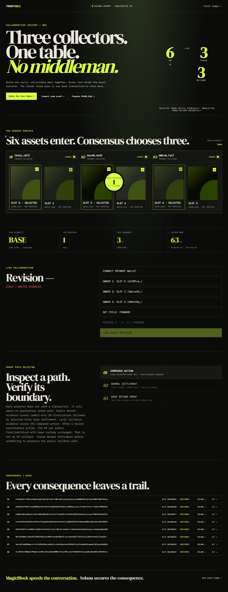
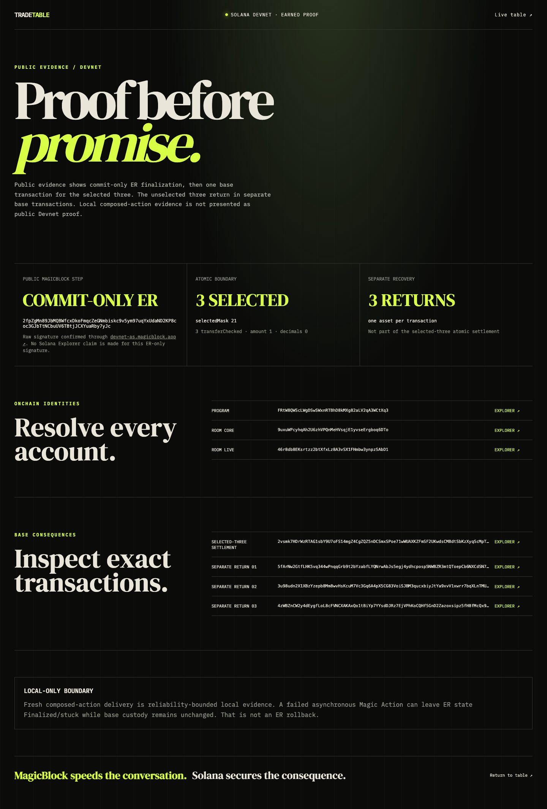

# TradeTable: Three collectors, one exact-revision trade

TradeTable is a three-party collectible barter protocol on Solana Devnet. Three collectors negotiate one cyclic allocation, lock the exact same revision, and settle the selected three assets in one base-layer transaction. MagicBlock accelerates the shared negotiation while Solana retains custody and recovery.

[](https://www.typescriptlang.org/)
[](https://nextjs.org/)
[](https://www.anchor-lang.com/)
[](LICENSE)

**Live:** https://app-gray-seven-93.vercel.app



## Live Demo

Open [TradeTable on Vercel](https://app-gray-seven-93.vercel.app) to inspect the earned room state without connecting a wallet. The [Proof Ledger](https://app-gray-seven-93.vercel.app/proof) links the public program, room accounts, settlement transaction, and three separate return transactions.

## What Is TradeTable?

Sequential three-way transfers force someone to move first. TradeTable replaces that first-mover risk with revision-bound consensus and program-controlled custody.

Each of three fixed participants deposits two eligible classic SPL collectibles. The group chooses one asset per owner and a forward or reverse cycle. Every new proposal clears prior locks. The third matching lock freezes the deal.

Exactly three selected assets settle atomically. Three unselected assets return separately. Public Devnet evidence uses commit-only ER finalization followed by a base settlement transaction.

## Screenshots

| Shared table | Proof ledger |
|---|---|
|  |  |

## Features

- **Three-party consensus:** three independent primary wallets must lock the same revision and allocation hash.
- **Visible stale-consent protection:** every proposal increments the revision and clears all previous locks.
- **Six-asset custody:** six canonical vault ATAs remain under a Solana PDA authority.
- **Two cyclic routes:** selected assets move in a complete forward or reverse derangement.
- **Selected-three atomicity:** three `transfer_checked` instructions execute in one base transaction.
- **Deterministic returns:** unselected or cancelled assets return to immutable owner destinations.
- **Authority-aware client:** the browser switches between base, Router, and direct ER authority.
- **Proof-first judge surface:** addresses, signatures, masks, and provenance stay visible without wallet access.

## How It Works

```text
Collector A ----|
Collector B ----|--> RoomLive (MagicBlock ER)
Collector C ----|      proposal + revision + exact locks
                       |
                       | commit and undelegate
                       v
RoomCore + six vault ATAs (Solana Devnet)
                       |
                       +--> one base transaction: 3 selected transfers
                       |
                       +--> three base transactions: 3 returns
```

### State split

| Account | Location | Responsibility |
|---|---|---|
| `RoomCore` | Solana base | Roster, custody ledger, expiry, masks, and settlement state |
| `RoomLive` | MagicBlock during negotiation | Revision, selected slots, cycle, locks, and allocation hash |
| Vault authority | Solana base | PDA signer for six canonical token vaults |

### Consensus rule

The allocation hash binds the room, revision, expiry, selected slots, cycle, and destinations. A lock records the current revision and hash. Any new proposal invalidates all existing consent.

### Settlement boundary

The public proof path commits and undelegates `RoomLive`, then calls permissionless `settle_committed` on Solana. That transaction moves only the selected three assets. Each unselected asset returns in its own later transaction.

The composed Magic Action path has local-validator evidence. It is not presented as public Devnet composed-action proof.

## Tech Stack

| Layer | Technology |
|---|---|
| Product UI | Next.js 15, React 19, TypeScript 5.9 |
| Solana client | `@solana/web3.js`, Anchor client, SPL Token |
| Program | Rust, Anchor 0.32.1 |
| Fast state | MagicBlock Ephemeral Rollups SDK 0.16.2 |
| Custody | Classic SPL Token vault ATAs |
| Hosting | Vercel |
| Network | Solana Devnet and MagicBlock Devnet ER |

## Testing

Run the full program and behavioral gate:

```bash
npm test
```

The verified pipeline passed 12 behavioral acceptance checks, 43 debug checks, and 147 grouped stress cases. Tests cover eligibility, authorization, revision races, settlement account substitution, cancellation, expiry, deterministic returns, client routing, and proof integrity.

## Try It (3 minutes)

1. Open the [live app](https://app-gray-seven-93.vercel.app).
2. Read `6 IN -> 3 TRADE + 3 RETURN` at the top of the table.
3. Inspect the three participant seats, selected cards, revision seal, and three locks.
4. Open the [Proof Ledger](https://app-gray-seven-93.vercel.app/proof).
5. Follow the base settlement signature to Solana Explorer.
6. Verify that it contains the selected three transfers.
7. Compare the three separate return signatures.

Wallet writes require one of the fixed room participants and an active negotiating room. The public earned room is provided as read-only evidence.

## Smart Contract

| Program | Address | Description |
|---|---|---|
| TradeTable | `FRtW8QWScLWgDSwSWxnRTBhD8kMXg82aLV2qA3WCtXq3` | Three-party custody, consensus, settlement, cancellation, and returns |

## On-Chain Verification

| What | Address / Link |
|---|---|
| Program | [Solana Explorer](https://explorer.solana.com/address/FRtW8QWScLWgDSwSWxnRTBhD8kMXg82aLV2qA3WCtXq3?cluster=devnet) |
| RoomCore | [Solana Explorer](https://explorer.solana.com/address/9uxuWPcyhqAh2U6zhVPQnMeHVsqjE1yvseErgboq6DTo?cluster=devnet) |
| Selected-three settlement | [Solana Explorer](https://explorer.solana.com/tx/2vsmk7HDrWzRTAG1sbY9U7oFS14mgZ4CgZQZ5nDCSmxSPoe71wWUAXKZFmSF2UKwdsCMBdtSbKzXyqScMpTH6BX5?cluster=devnet) |
| Proof manifest | [`submission/proof.md`](submission/proof.md) |

## Running Locally

```bash
git clone https://github.com/dmustapha/TradeTable.git
cd TradeTable
cp .env.example .env.local
npm install
npm run dev
```

Open `http://localhost:3000`.

### Required Environment Variables

| Variable | Description |
|---|---|
| `NEXT_PUBLIC_PROGRAM_ID` | Deployed TradeTable program |
| `NEXT_PUBLIC_DEMO_ROOM` | Public RoomCore account |
| `NEXT_PUBLIC_DEMO_LIVE` | Linked RoomLive account |
| `NEXT_PUBLIC_SOLANA_RPC_URL` | Solana Devnet RPC endpoint |
| `NEXT_PUBLIC_SOLANA_WS_URL` | Solana Devnet WebSocket endpoint |
| `NEXT_PUBLIC_MAGIC_ROUTER_RPC` | MagicBlock Router RPC endpoint |
| `NEXT_PUBLIC_MAGIC_ROUTER_WS` | MagicBlock Router WebSocket endpoint |
| `NEXT_PUBLIC_MAGIC_ER_RPC` | Direct MagicBlock ER RPC endpoint |
| `NEXT_PUBLIC_MAGIC_ER_WS` | Direct MagicBlock ER WebSocket endpoint |
| `DEMO_PAYER_KEYPAIR` | Local path used only by operator scripts |

Public defaults are documented in [`.env.example`](.env.example). Never commit an operator keypair.

## Project Structure

```text
src/app/                 Next.js judge and collaboration surfaces
src/lib/tradetable.ts    Account decoding, routing, and transactions
src/idl/                 Generated program interface
programs/tradetable/     Anchor program
scripts/ops.ts           Seed, measure, and proof commands
tests/                   Contract, client, and security tests
submission/              Public Devnet proof and measurements
```

Built for [Solana Blitz v7](https://build.magicblock.app/?event=10&stage=blitz) with MagicBlock.

## License

MIT
